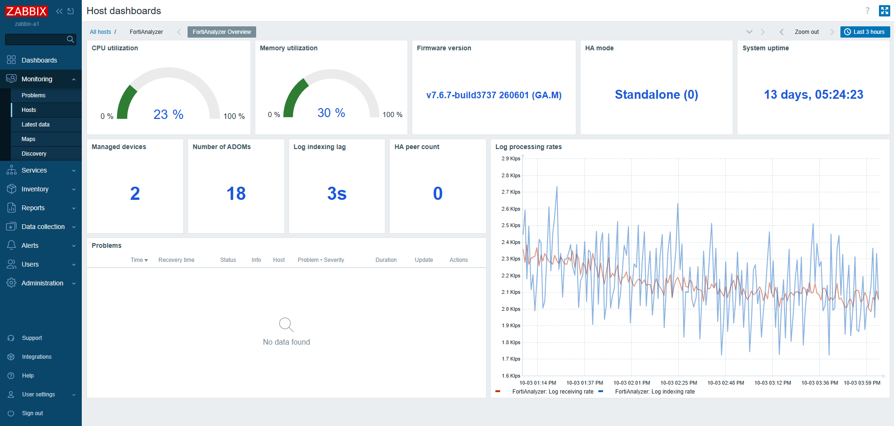

# Zabbix FortiAnalyzer SNMP Template

[](https://www.zabbix.com/)
[](https://www.fortinet.com/products/management/fortianalyzer)
[](https://datatracker.ietf.org/doc/html/rfc3414)
[](https://datatracker.ietf.org/doc/html/rfc3414)
[](LICENSE)

A modern Zabbix template for monitoring Fortinet FortiAnalyzer appliances through SNMP.

The template uses numeric OIDs, so installing Fortinet MIB files on the Zabbix server or proxy is not required.

## Tested environment

| Component | Version or configuration |
|---|---|
| Zabbix Server | 7.0.31 |
| FortiAnalyzer platform | VM64 |
| FortiAnalyzer version | v7.6.7 build 3737 |
| SNMP version | SNMPv3 |
| Security level | `authPriv` |
| Authentication protocol | SHA |
| Privacy protocol | AES |
| OID format | Numeric |
| Fortinet MIB required | No |

## Features

The template provides monitoring for the following FortiAnalyzer components and resources.

### System monitoring

- System name
- System object identifier
- Serial number
- Firmware version
- System uptime
- CPU utilization
- CPU utilization excluding nice processes
- Memory capacity
- Memory usage
- Memory utilization

### FortiAnalyzer log processing

- Log receiving rate
- Average log receiving rate
- Log indexing rate
- Log indexing lag
- Log volume received today
- Log volume received yesterday
- Seven-day average log volume

### ADOM monitoring

Low-level discovery is used to detect and monitor administrative domains.

Collected ADOM information includes:

- ADOM name
- ADOM state
- ADOM operation mode
- Number of managed devices
- Number of policy packages
- Archive quota
- Archive retention
- Archive used space
- Archive utilization
- Analytics quota
- Analytics retention
- Analytics used space
- Analytics utilization
- Log receiving rate
- Log volume received today
- Log volume received yesterday
- Weekly average log volume

By default, ADOMs without managed devices are excluded by the discovery filter.

### Managed device monitoring

Low-level discovery is used to identify Fortinet devices managed by FortiAnalyzer.

Collected managed device information includes:

- Device name
- Serial number
- Model
- Management IP address
- Assigned ADOM
- Operating system major version
- Operating system minor release
- Operating system build number
- Connection state
- Configuration state
- Database state
- Support contract state
- HA mode
- HA group
- VDOM state
- One-hour log receiving rate average
- One-day log receiving rate average
- Seven-day log receiving rate average
- Archive log used space

The template also collects the total number of managed devices and managed VDOMs reported by FortiAnalyzer.

### Storage monitoring

Storage resources are discovered dynamically using SNMP low-level discovery.

The template collects:

- Storage allocation unit
- Total allocation units
- Used allocation units
- Total storage capacity
- Used storage capacity
- Storage utilization percentage

The default discovery filter includes the following FortiAnalyzer storage resources:

- `Compact Flash Disk`
- `Internal Hard Disk`

Physical memory and swap entries are excluded from storage discovery.

### Disk I/O monitoring

FortiAnalyzer disk resources are discovered through a separate vendor-specific discovery rule.

The template collects:

- Disk name
- Disk I/O utilization

### High availability monitoring

The template collects the following FortiAnalyzer HA information:

- HA mode
- HA cluster ID
- HA peer count

HA scalar metrics have been validated on a standalone FortiAnalyzer appliance but not against an active HA cluster.

HA peer discovery is planned for a future update after validation against an active FortiAnalyzer HA environment.

### Triggers

The template includes configurable triggers for:

- High and critically high CPU utilization
- High and critically high memory utilization
- High and critically high storage utilization
- High and critically high disk I/O utilization
- High and critically high ADOM archive utilization
- High and critically high ADOM analytics utilization
- High and critically high log indexing lag
- FortiAnalyzer restart detection
- SNMP data collection failure
- Managed device connection failure
- Managed device configuration synchronization failure
- HA enabled without an available peer

Trigger thresholds can be customized through template macros.

Warning triggers depend on their corresponding critical triggers to prevent duplicate problems.

### Graphs

The template includes graphs and graph prototypes for:

- System resource utilization
- Log processing rates
- Log indexing performance
- Log volume
- ADOM log utilization
- Storage utilization
- Disk I/O utilization

## Dashboard

The template includes a dashboard providing a consolidated view of system resources, log processing, ADOMs, managed devices, HA status, and active problems.



## Requirements

- Zabbix 7.0 or later
- FortiAnalyzer with SNMP enabled
- Network connectivity from the Zabbix server or proxy to the FortiAnalyzer SNMP interface
- An SNMP interface configured on the Zabbix host
- SNMPv2c or SNMPv3 credentials supported by the target FortiAnalyzer configuration

The tested environment uses SNMPv3 with `authPriv`.

The template does not contain SNMP usernames, authentication passwords, privacy passwords, community strings, management addresses, or other environment-specific credentials.

## Installation

1. Download the following template file:

   ```text
   templates/template_fortianalyzer_snmp.yaml
   ```

2. Sign in to the Zabbix frontend.

3. Navigate to:

   ```text
   Data collection → Templates
   ```

4. Select **Import**.

5. Select `template_fortianalyzer_snmp.yaml`.

6. Review the import options and complete the import.

7. Create or open the FortiAnalyzer host.

8. Add an SNMP interface using the FortiAnalyzer management address.

9. Configure the required SNMP credentials on the host interface.

10. Link the `FortiAnalyzer by SNMP` template to the host.

11. Wait for the first polling and low-level discovery cycles to complete.

12. Review the collected values under:

    ```text
    Monitoring → Latest data
    ```

For additional information, see the [installation guide](docs/installation.md).

## SNMP configuration

The tested configuration uses SNMPv3 with the following security settings:

```text
Security level: authPriv
Authentication protocol: SHA
Privacy protocol: AES
```

SNMP credentials must be configured on the Zabbix host SNMP interface and must never be stored inside the template export or committed to the repository.

## Template design

This template follows these design principles:

- Numeric OIDs are used to avoid a runtime dependency on external MIB files.
- Low-level discovery is used for dynamic resources such as ADOMs, managed devices, storage resources, and disks.
- Calculated items are used where utilization or capacity values must be derived from collected metrics.
- Environment-specific values and credentials are kept outside the exported template.
- Item keys are unique and predictable.
- Discovery rules and item prototypes are separated by monitored resource type.
- Trigger thresholds are configurable through template macros.
- Warning triggers depend on their corresponding critical triggers to prevent duplicate problems.
- Hardware-specific sensor monitoring is not included without validation on physical FortiAnalyzer appliances.

## Known limitations

- The template has currently been validated only against FortiAnalyzer VM64 v7.6.7 build 3737.
- HA peer discovery is not included.
- HA-related trigger behavior has not been validated against an active FortiAnalyzer HA cluster.
- Hardware-specific sensors are not included because testing was performed on a FortiAnalyzer VM64 appliance.

## Documentation

| Document | Description |
|---|---|
| [Installation guide](docs/installation.md) | Template import and host configuration |
| [Metrics reference](docs/metrics.md) | Items, discovery rules, prototypes, and monitored resources |
| [Testing notes](docs/testing.md) | Tested versions, validation process, and known limitations |
| `screenshots/` | Zabbix dashboard and monitoring screenshots |
| `templates/` | Importable Zabbix template files |

## License

This project is licensed under the [MIT License](LICENSE).

## Author

**Soroush Mehmandoust**

- GitHub: [soroushmhd](https://github.com/soroushmhd)